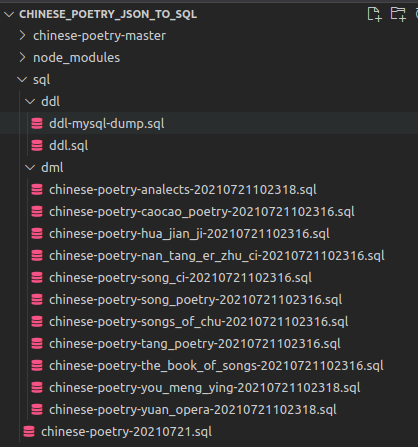
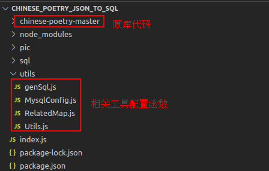

# 说明

使用 JavaScript，将有名(\*多)的诗词数据收集开源库[chinese-poetry](https://github.com/chinese-poetry/chinese-poetry)中，感兴趣的的中国古诗词转换为 sql 语句.

此时是 2021-07-21,如果非最新,只要该 chinese-poetry 库的 json 数据结构没有变化,这个 js 脚本应该还可以用.

只是把数据进行 sql 转化，未做其他操作，如果原数据有问题，存入 db 依旧有问题。（例如不是简体，内容不正确等）

# 使用方法

## 简单版本

直接下载本项目，找到 sql 文件夹下 sql 语句即可

已经转换好的内容:

| 文集代号           | 文集中文名称 | chinese-poetry-master 源码中相对位置                         |
| ------------------ | ------------ | ------------------------------------------------------------ |
| the_book_of_songs  | 诗经         | shijing/shijing.json                                         |
| songs_of_chu       | 楚辞         | chuci/chuci.json                                             |
| caocao_poetry      | 曹操诗集     | caocaoshiji/caocao.json                                      |
| tang_poetry        | 唐诗         | json/poet.tang.\*.json                                       |
| hua_jian_ji        | 花间集       | wudai/huajianji/huajianji-\*.json(除 perface)                |
| nan_tang_er_zhu_ci | 南唐二主词   | wudai/nantang/poetrys.json                                   |
| song_ci            | 宋词         | ci/ci.song.\*.json                                           |
| song_poetry        | 宋诗         | json/poet.song.\*.json                                       |
| yuan_opera         | 元曲         | yuanqu/yuanqu.json(注意,原库 json 格式有问题,转换前要先处理) |
| analects           | 论语         | lunyu/lunyu.json                                             |
| you_meng_ying      | 幽梦影       | youmengying/youmengying.json                                 |

根据需求，先运行 ddl 创建数据库和表，然后运行 dml 插入指定文集的数据即可。

最外面 sql 文件的是所有文集的数据。

2021-07-21
蒙学 和 四书五经 没有处理，因为个人感觉这部分内容意义不大。

## 手动版本

首先，需要下载原库`chinese-poetry-master`放到本项目根目录下。

然后，在有 nodejs 环境下安装依赖`npm i`后直接运行`node index.js`即可。

说明：

1. 其实代码中有[配置数据库连接操作](utils/MysqlConfig.js)（mysql、mariadb、tidb 应该通用）。
2. 在 index.js 中可以配置需要转换的文集内容，并配置是否要存入 db 中（存入之前也要先运行 ddl 创建好 db 和 table），默认只生成 sql 文件。
3. 在[构建 sql 语句的函数](utils/genSql.js)`buildSQLStatement`中，有设置参数是否保留原 json 中正文部分的换行，和 sql 语句中 value 值是否换行，可以按需调整。默认诗歌正文没有保留换行，sql 语句一行一条 value。
4. **截止 2021/07/21，原库中元曲的 json 文件格式有问题（首句没有[，每个{}没有逗号分隔），所以转换为 sql 前有先格式化一次，如果后续原库有改动，则代码中也一并改动。**
5. 相关的路径、文集代号、栏位信息等主要存在于[关系对象](utils/RelatedMap.js)中，如果默认的不符合自己实际需求，可以按需调整，注意与数据库栏位等要保持一致。**建议确认 ddl 文件是否符合自己需要，不符合可自行简单修改代码去满足。**
6. 因为使用的是 fs.appendFileSync 方法，虽然有在文件名加上时间戳，也不排除可能同时多运行时导致内容重复。

# 补充

2021/07/21
我看到似乎有不少人需要简体的唐诗宋词的需求，有时间我也去抓抓数据看看。
